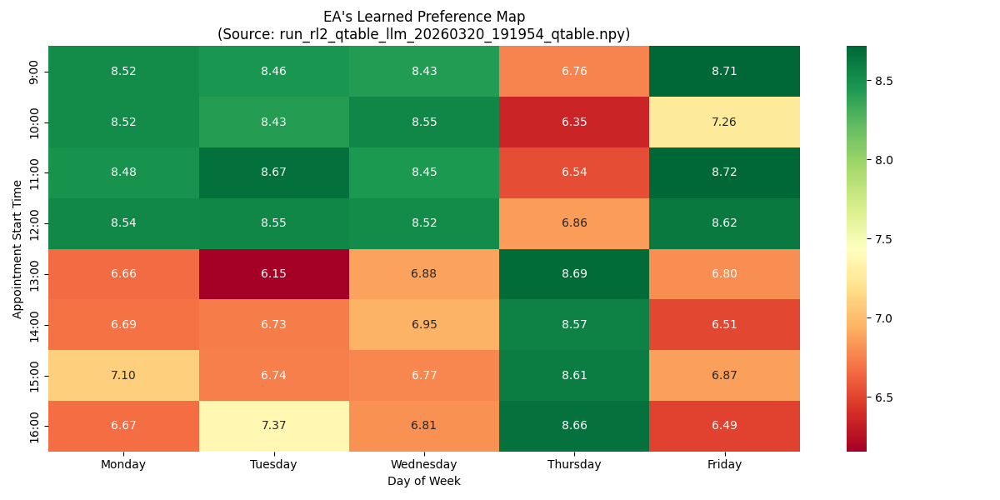

Glyptic RL: Emergent World Models in LLM-powered Agents
================================================

This research project introduces Glyptic Knowledge, a framework for Reinforcement Learning (RL) designed to accelerate learning in LLM-powered agents. While standard Large Language Models pass vast amounts of explicit, pre-trained knowledge, they often struggle to adapt to real-world settings. Glyptic knowledge is my term for knowledge acquired while doing, as opposed to pre-trained knowledge. I call this glyphic knowledge (from the Greek word for carving), and it's inspired by the epistomological theories of Dewey. The overall goal is to develop algorithms that show accelerating learning rates and even breakthroughs similar to the grokking phenomenon in pre-training.

The code below shows a toy system: an AI-powered executive assistant (EA) is scheduling meetings for his boss, while trying to learn his boss's favorite times during the week. They exchange brief messages using LLM. Over several weeks of training, the EA agent develops a map of his boss's preference (see graphic)

Table showing EA's learned knowledge

Additional results, including more advanced training methods, are currently in development and will be published to this repository in the coming months.

## Contents
- `rl1_qtable/` — RL for an agent acting as an Executive Assistant (Q-table RL)
- `rl2_qtable_llm/` — Refinment of RL1 : agent is now using LLM

## Quickstart

1. Install dependencies:

   uv sync

2. Run an experiment:

   python rl2_qtable_llm/main.py
   or
   python rl1_qtable/main.py

## Notes
- This repo is experimental / scientific work: expect informal structure and evolving APIs.
- Dependencies are managed with [uv](https://docs.astral.sh/uv/) via `pyproject.toml`.

## Contributing
- Feel free to fork, experiment, and submit patches or notes explaining what you changed and why.

## License
- MIT

## Contact
- For questions about these experiments, open an issue or contact the repository owner.
